# mapbox 基本架构和渲染（不完全）

> 来源互联网 [这里](https://www.cnblogs.com/dojo-lzz/p/10165817.html)，可以了解大致内部逻辑，详细的结构待分析

## 基本架构
mapbox的架构有些奇怪，接口层和逻辑层其实没有明确的区分；mapbox中style是一个比较重要的类；统辖整个数据层次；Painter中集成了draw和style两个模块
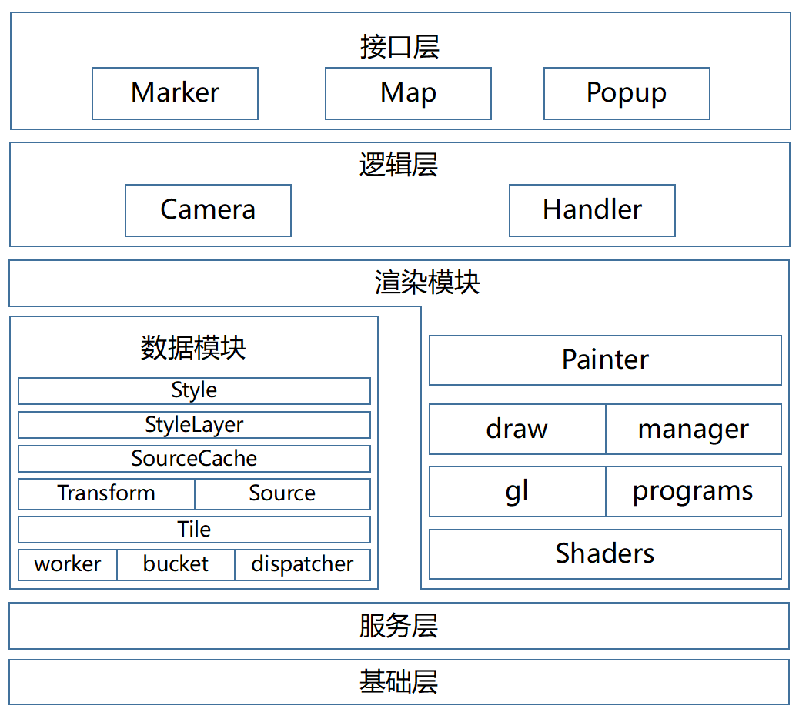

## 数据处理流程
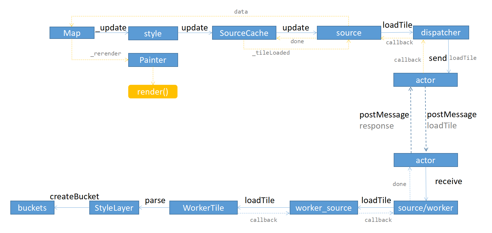

## 数据加载和渲染流程

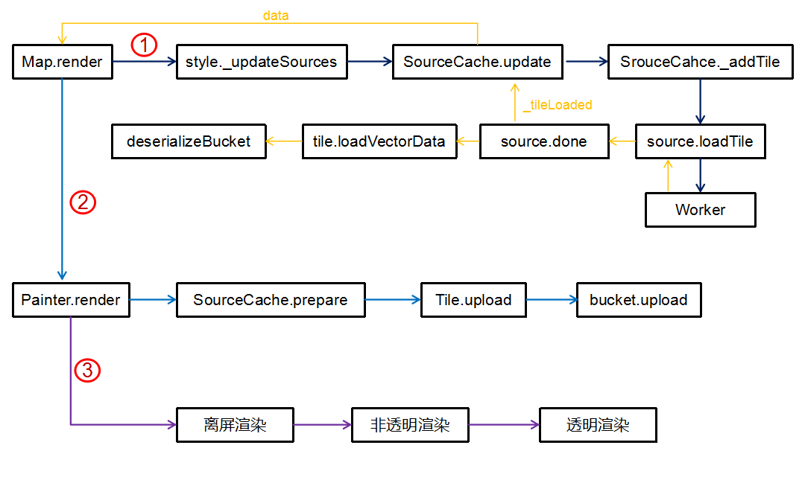

数据的加载与解析在source中；主要有两部分组成，逻辑部分在主线程中比如：
vector_tile_source、geojson_source中
而实际的加载解析则是在对应的worker中，比如：
vector_tile_worker_source、geojson_worker_source中

以vector_tile_source和vector_tile_worker_source为例介绍，实际的数据解析在vector_tile_worker_source中的loadTile方法，这里接收主线程中传递的参数，以及子线程的回调函数，应该是Actor中的done函数

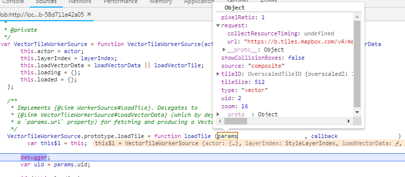

进而进入loadVectorData函数，getArrayBuffer是调用普通的ajax去请求二进制数据，与室内的数据方式一样。数据请求成功后，将二进制数据实例化成一个

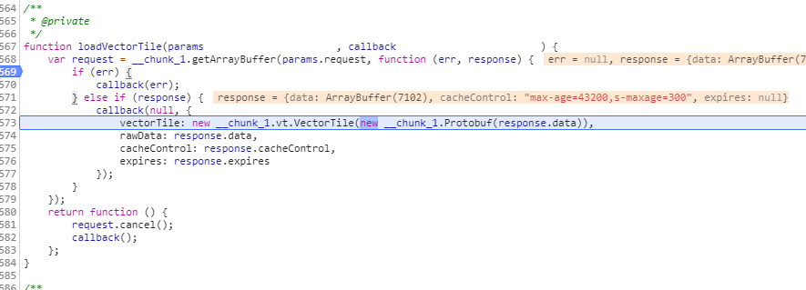
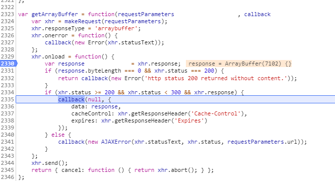

PBF是一个协议二进制格式，他里面提供了一些方法，方便按照一定的规则来解析二进制数据。

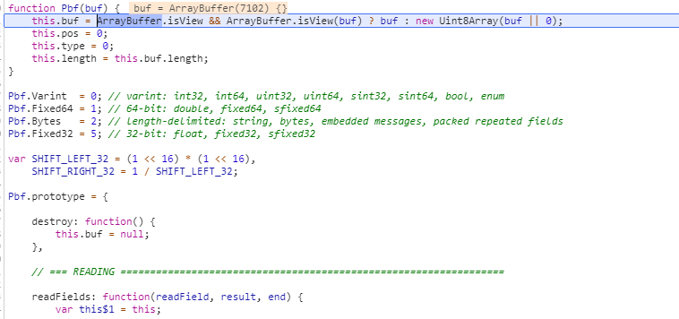
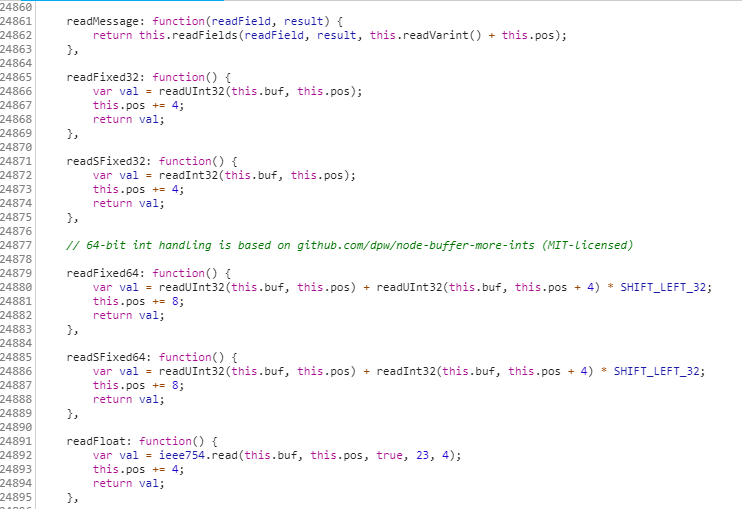

这里是VectorTile中的一个VectorTileLayer读取到的二进制字段；这里的解析是把二进制转化成js对象，里面的数据还需要进一步转换成可用的几何数据和属性数据。

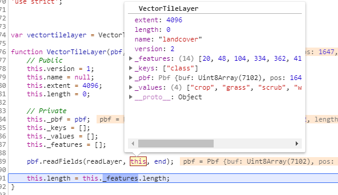

因为mabox的二进制编码使用的是谷歌的二进制编码方式，所以可以直接使用PBF这个npm包来进行解码
LoadVectorData加载完后数据进入回调函数中；

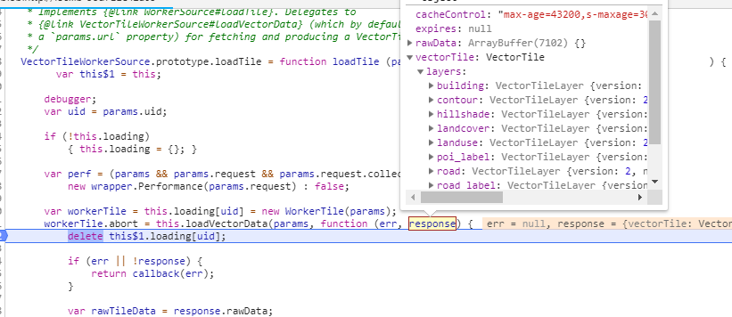

接下来进入WorkerTile中的parse方法，开始各种解析数据；这里面要看一下LayerIndex这个对象是StyleLayerIndex的一个实例，里面存放一些跟样式相关的属性

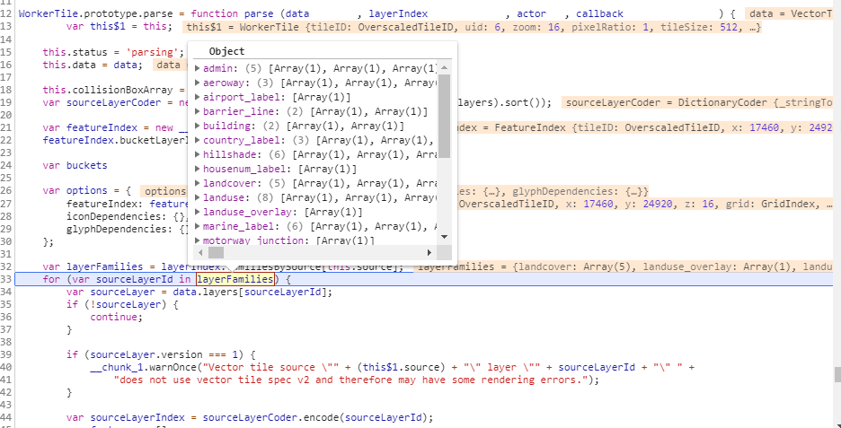

然后从sourceLayer中获取VectorTileFeature，实际也是从pbf中解析数据

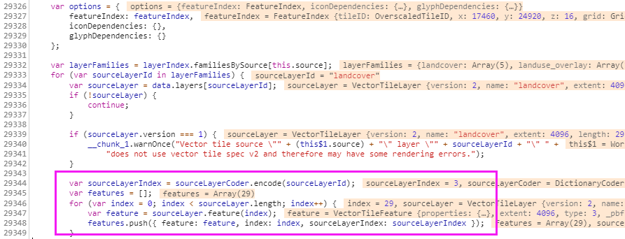

接下来是创建bueket并调用bucket的populate方法

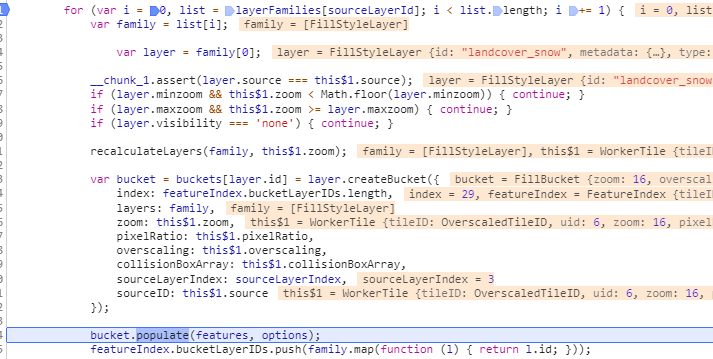
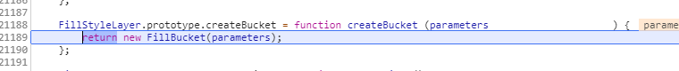

polulate可以理解为首先根据比例进行数据缩放，然后调用addFeature方法，将Feature的几何图形信息添加到bucket的vertexArray中，然后FeatureIndex记录一些信息。
不同的Bucket的polulate方法也不同，addFeature方法更不同。像SymbolBucket添加到vertexArray中的就不是单一的点信息，而是文本盒子的信息。

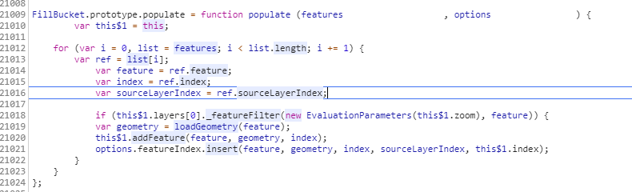